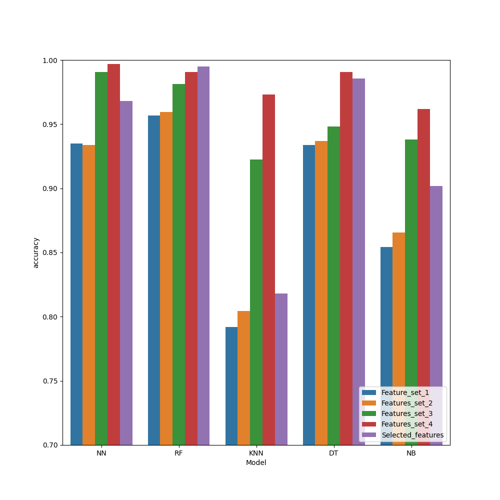
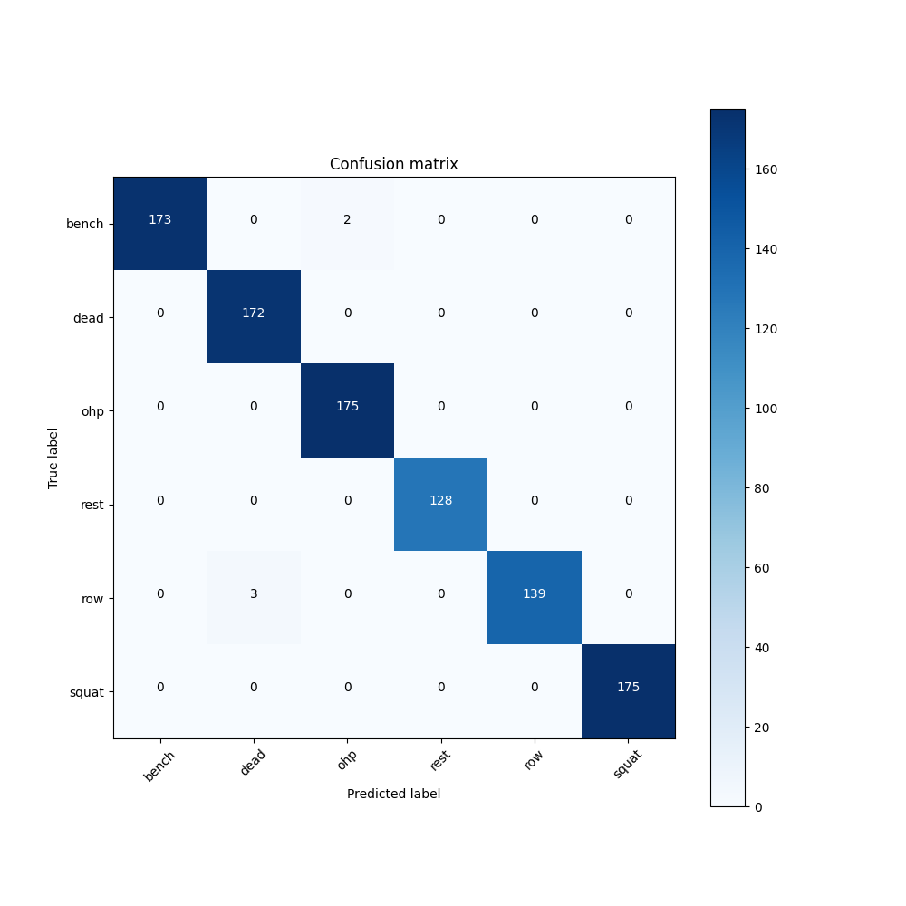
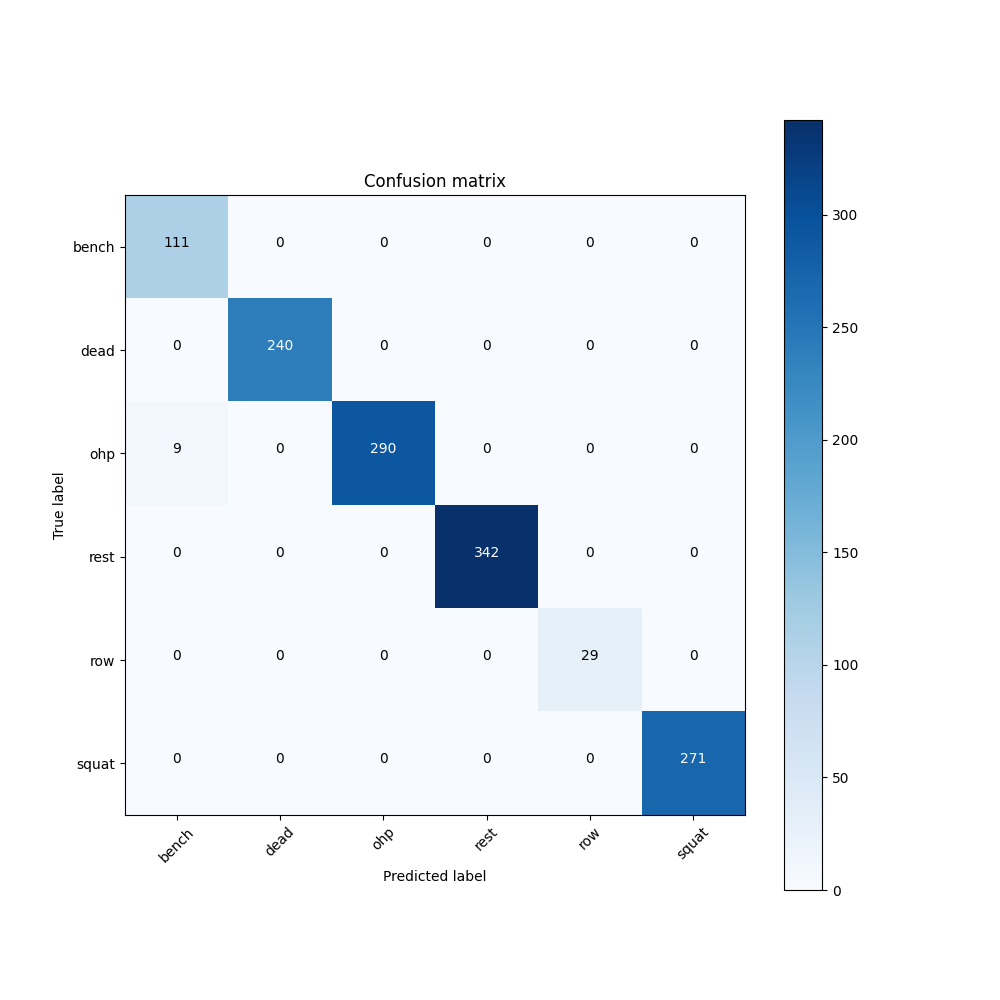

# Classifying Weightlifting Exercises

**Project Description**: This project involves processing, visualising, and modelling real accelerometer and gyroscope data from a sensor to create a machine learning model that can classify weightlifting exercises.

## Overview

- **Data Ingestion and Visualisation**: Process raw sensor data, combining accelerometer and gyroscope data into a single dataframe. Then plot combined accelerometer and gyroscope data for each participant and label.

- **Outlier Removal**: Outlier detection using various methods (IQR, ***Chauvenet's criterion***, LOF, Isolation Forest, and Gaussian distribution), visualising the detected outliers, and removing them.

- **Feature Engineering**: Applied various feature engineering techniques, including low-pass filtering, Principal Component Analysis (PCA), Fourier transformation, and K-means clustering, to enhance the dataset by capturing relevant patterns and structures.

- **Model Selection, Training, and Hyperparameter Tuning**: Train and evaluate various classification models (Neural Network, ***Random Forest***, KNN, Decision Tree, Naive Bayes), using different sets of features and hyperparameter tuning (GridSearchCV) to identify the best-performing model and feature set.

- **Model Evaluation**: 
  - **Full Dataset Evaluation**: Assess the Random Forest model's performance using the complete dataset, which includes all participants' data in both the training and test sets. Metrics used for evaluation include accuracy and a confusion matrix.
  - **Participant Exclusion Evaluation**: Exclude one participant from the dataset, train the model on the remaining participants' data, and evaluate its performance on the excluded participant. This assessment also utilises accuracy and a confusion matrix to measure performance.

## Data Visualisation Example of Participant A Doing Bench Press
.png)

## Model's Performance on Different Feature Sets

## Confusion Matrix on the Whole Dataset

## Confusion Matrix Predicting for Participant A Using the Rest of the Participants' Data

